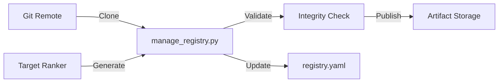

# Design Doc: Index Automation & Lifecycle Management

**Status:** Proposed
**Author:** AI Agent
**Date:** Feb 4, 2026
**Related to:** `registry_architecture.md`

## 1. Objective

To automate the maintenance of `ranked_targets.yaml` indices for supported knowledge bases. This system will allow us to easily generate, validate, and publish indices for new releases of libraries (like `adk-python`) without manual intervention.

## 2. Problem

Currently, `ranked_targets.yaml` is generated manually using the `target_ranker` tool. This process is:
1.  **Manual:** Requires cloning specific versions and running scripts by hand.
2.  **Opaque:** No easy way to see what changed between versions (did important classes disappear?).
3.  **Fragile:** No automated validation to ensure the "Happy Path" symbols are actually present.

## 3. Workflow Specification

We will implement this automation as part of the `tools/manage_registry.py` CLI suite.

### 3.1 `check-updates`
Scans all repositories in `registry.yaml`, queries `git ls-remote --tags`, and reports versions present in git but missing from the registry.

### 3.2 `add-version <repo_id> <version>` (The Builder)

This command orchestrates the entire lifecycle of adding a new version.

**Steps:**

1.  **Clone:**
    *   Clone the repository to a temporary workspace: `~/.mcp_cache/tmp/<repo_id>/<version>`.
    *   Checkout the specific tag.

2.  **Index Generation:**
    *   Run the `target_ranker` on the cloned source.
    *   **Optimization:** Incorporate "Usage Frequency" data if available (see `advanced_api_discovery.md`) to weight common symbols higher.
    *   **Docstring Injection:** Merge raw AST docstrings with any "Functional Snippets" or "Artifact Instructions" defined in the repo configuration.

3.  **Validation (Integrity Check):**
    *   Verify that critical "Golden Symbols" are present.
    *   *Example:* For `adk-python`, ensure `google.adk.agents.Agent` is ranked in the top 50.
    *   If validation fails, abort the process to prevent publishing a broken index.

4.  **Delta Reporting:**
    *   Compare the new index against the previous version's index.
    *   Generate a summary: "Added 5 classes, Removed 2 methods, `RunConfig` rank changed 10 -> 5".

5.  **Bundle/Publish:**
    *   Save the final index to `data/indices/` (or upload to GCS/S3).
    *   Calculate SHA/Checksum for integrity.

6.  **Registry Update:**
    *   Append the new version entry to `registry.yaml` with the local or remote URL.

## 4. Architecture Integration

This automation sits between the Git Repositories and the MCP Registry.

## 5. Implementation Tasks

1.  **`tools/manage_registry.py`**:
    *   Implement `GitClient` for `ls-remote` and `clone`.
    *   Wrap `target_ranker` module for programmatic execution.
    *   Implement `IndexValidator` class.

2.  **Configuration**:
    *   Add validation rules to `registry.yaml` (optional "golden_symbols" list per repo).

3.  **CI/CD**:
    *   Create a GitHub Action/Workflow to run `check-updates` weekly and open a PR if new versions are found.
