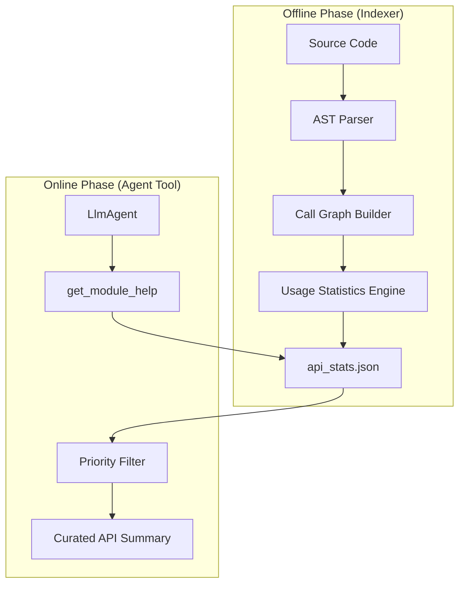

# Design Doc: Statistical Module Help via Pre-computed AST Analysis

**Status:** Draft
**Author:** Gemini Agent
**Date:** 2026-01-10

## 1. Problem Statement
The current `get_module_help` tool uses Python's runtime `inspect` module to dump the entire public API of a package. For complex libraries like `adk-python`, this results in excessive token consumption (often > 5k tokens per module) and noise. Agents struggle to distinguish between *critical* arguments (e.g., `model`, `instruction`) and *obscure* optional configuration (e.g., `generate_content_config`, `safety_settings`), leading to hallucinations or incorrect usage patterns.

## 2. Objective
Create an advanced version of `get_module_help` that returns a **statistically curated** view of the API. Instead of showing *all* possibilities, it should prioritize the **"Happy Path"**: the functions and arguments that are most frequently used in the codebase (tests, examples, and internal calls).

**Key Metrics:**
*   Reduce token count by > 60% compared to raw `inspect` dumps.
*   Increase "First-Attempt Pass Rate" by surfacing the most idiomatic arguments.

## 3. High-Level Architecture

The system consists of two distinct phases: an **Offline Indexing Phase** (build time) and an **Online Query Phase** (run time).



## 4. Detailed Design

### 4.1. Offline Phase: AST Analysis & Statistical Modeling

We will use Python's `ast` module to statically analyze the repository.

**Step 1: Definition Extraction**
*   Identify all Classes and Functions.
*   For each function, record the full signature (args, defaults, type hints).

**Step 2: Usage Analysis (The "Arcs")**
*   Scan the entire codebase (especially `tests/` and `examples/`) for **Call Sites**.
*   For every call `MyClass(a=1, b=2)`:
    *   Resolve `MyClass` to its definition.
    *   Increment a counter for `MyClass` usage.
    *   Increment a counter for argument `a` and argument `b`.

**Step 3: Calculating Priority**
We calculate a **Usage Score (0.0 - 1.0)** for every argument.

*   **Mandatory Args:** Score = 1.0 (Always show).
*   **Optional Args:** Score = `Count(Arg used in calls) / Count(Function called)`.
    *   *Example:* If `LlmAgent` is initialized 100 times, and `model` is passed 95 times, its score is 0.95. If `safety_settings` is passed 2 times, its score is 0.02.

**Step 4: Index Generation**
The `api_stats.json` will store:
```json
{
  "google.adk.agents.LlmAgent": {
    "usage_count": 150,
    "arguments": {
      "name": {"score": 1.0, "type": "str"},
      "model": {"score": 0.98, "type": "str"},
      "instruction": {"score": 0.95, "type": "str"},
      "generate_content_config": {"score": 0.05, "type": "GenerateContentConfig"}
    }
  }
}
```

### 4.2. Online Phase: The Tool

The `get_module_help` tool will accept a `verbosity` parameter.

**Signature:**
`get_module_help(module_name: str, verbosity: str = "standard") -> str`

**Filtering Logic ("standard" mode):**
1.  **Classes:** Show classes with `usage_count > threshold` (e.g., > 0 usages).
2.  **Arguments:**
    *   Show all **Mandatory** arguments.
    *   Show **Optional** arguments where `score > 0.2` (used in at least 20% of cases).
    *   **Hide** everything else, replacing them with a comment: `# ... + 12 less common arguments (use verbosity='high' to see)`.

### 4.3. Handling Pydantic Models
Since ADK uses Pydantic, the AST analyzer must treat `class MyModel(BaseModel)` fields as "arguments" to the `__init__` constructor.
*   **Arc:** Usage of `MyModel(field=val)` counts as usage of `field`.
*   **Validation:** This directly addresses the "Validation Error" loops we saw in benchmarks by hiding strict/forbidden fields that are rarely used and highlighting the required ones.

## 5. Implementation Plan

### Phase 1: The Indexer (`tools/generate_api_stats.py`)
*   Implement `AstUsageVisitor(ast.NodeVisitor)` to walk the tree.
*   Implement symbol resolution (tracking imports is hard, simpler heuristic: match by Name).
*   Output the JSON index.

### Phase 2: The Tool (`benchmarks/answer_generators/adk_tools.py`)
*   Update `get_module_help` to load the JSON if available.
*   Implement the filtering logic.
*   Fallback to standard `inspect` if no index exists.

## 6. Example Output Comparison

**Current (Raw Inspect):**
```python
class LlmAgent(BaseAgent):
    def __init__(self, name: str, model: str = None, instruction: str = None, 
                 chat_history: list = None, tools: list = None,
                 generate_content_config: dict = None, safety_settings: dict = None,
                 system_instruction: str = None, ...):
```

**Proposed (Statistical):**
```python
class LlmAgent(BaseAgent):
    # Usage Priority: High (150 calls)
    def __init__(
        self, 
        name: str,              # Mandatory
        model: str,             # Used 98%
        instruction: str,       # Used 95%
        tools: list = None,     # Used 40%
        # ... + 8 less common arguments
    ):
```

## 7. Risks & Mitigation
*   **Risk:** The "Happy Path" in tests might not reflect user intent (overfitting to unit tests).
    *   *Mitigation:* Include `examples/` and "Golden Code" snippets in the analysis set, weighted higher than unit tests.
*   **Risk:** New/Rare features become undiscoverable.
    *   *Mitigation:* The tool output explicitly mentions hidden args and tells the agent how to see them (`verbosity='high'`).
