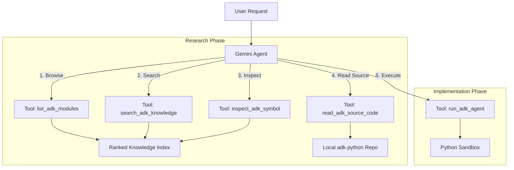
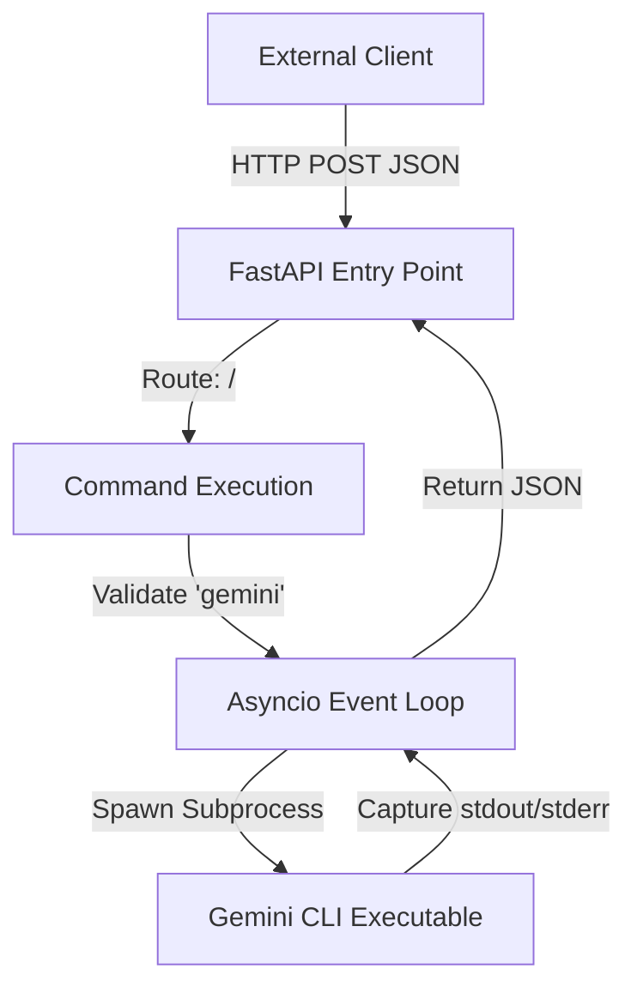
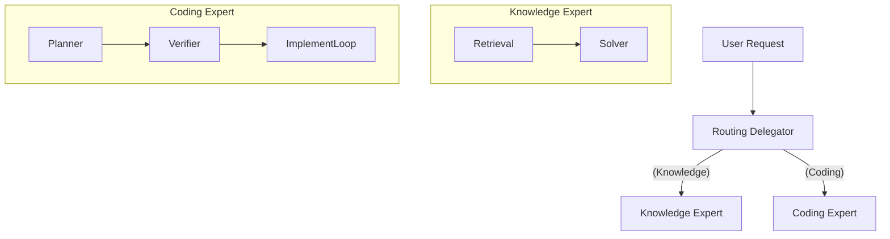
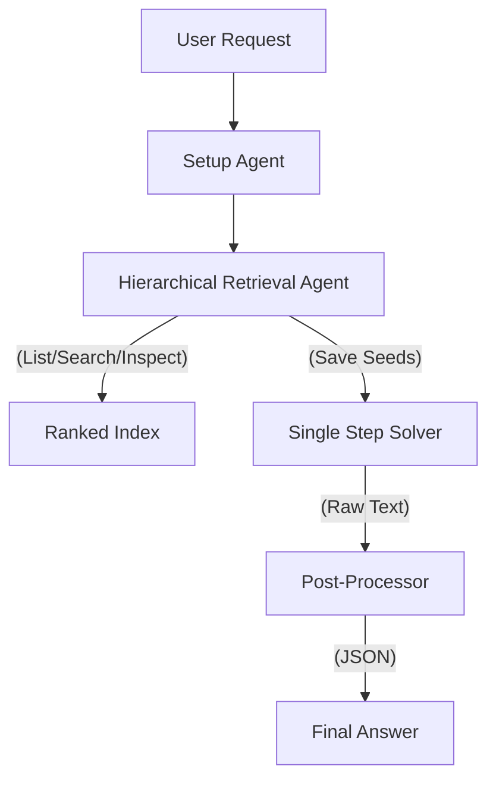

# Answer Generator Architectures

This file documents the architectural designs of the Answer Generators used in the benchmark suite. It is used by the report generator to provide context for the AI analysis.

## gemini-cli:mcp_adk_agent_runner_ranked_knowledge

**Source Image:** `gemini-cli:mcp_adk_agent_runner_ranked_knowledge`

### Core Philosophy
A specialized "Research-then-Implement" single-agent architecture. It enforces a strict protocol where the agent must browse and inspect a high-fidelity **Ranked Knowledge Index** before attempting to generate or execute code. This grounds the model in the actual API surface, minimizing hallucinations.

### Topology
Single Agent with Specialized Knowledge Tools (ReAct-like Workflow)

### Key Tool Chain
- `list_adk_modules`: **Browsing**. Returns a paginated, ranked list of ADK modules/classes (sorted by importance/usage).
- `search_adk_knowledge`: **Search**. Hybrid Semantic/BM25 search against the index. Supports multiple queries in parallel.
- `inspect_adk_symbol`: **Deep Dive**. Retrieves the exact structured specification (signatures, docstrings) for a symbol from the index.
- `read_adk_source_code`: **Ground Truth**. Reads the raw source code from disk if the index is insufficient.
- `run_adk_agent`: **Execution**. Runs the generated agent code in a sandbox.

### Architecture Overview
The system operates as a containerized agent governed by a comprehensive system prompt (`INSTRUCTIONS_MCP_RUNNER.md`). Unlike hierarchical multi-agent systems, this architecture relies on a single, highly-instructed LLM to orchestrate its own research and implementation phases.
1.  **Research Phase:** The agent is mandated to "Browse First" (`list_adk_modules`) to discover relevant entry points without guessing names. It then drills down using `inspect_adk_symbol` or `search_adk_knowledge` (Vector/BM25) to retrieve precise signatures.
2.  **Implementation Phase:** Once grounded, the agent generates code and executes it via `run_adk_agent`.
3.  **MCP Integration:** All knowledge retrieval is mediated by a custom Model Context Protocol (MCP) server (`adk-knowledge`) that wraps the `ranked_targets.yaml` index and the local git repository.

### Variants
- **vector (Default):** Enables embedding-based semantic search in `search_adk_knowledge`.
- **bm25:** Uses strictly keyword-based retrieval.

### Call Hierarchy


## gemini-cli:base

### Core Philosophy
A lightweight, asynchronous wrapper designed to expose local system CLI execution and file system access via a RESTful HTTP interface.

### Topology
Client-Server (REST API Gateway Pattern)

### Key Tool Chain
- Python 3 / FastAPI / Uvicorn
- Gemini CLI (Native)

### Architecture Overview
The architecture functions as a bridge between HTTP clients and the local operating system. It utilizes FastAPI to define a lightweight server that intercepts network requests and translates them into local system actions. The design relies heavily on Python's `asyncio` library to perform non-blocking subprocess execution, allowing the server to spawn shell commands (specifically the `gemini` CLI) and capture their `stdout` and `stderr` without halting the web server's event loop.

### Call Hierarchy


## gemini-cli:adk-docs-ext

**Source:** `https://github.com/pierpaolo28/adk-docs-ext` (main branch)

### Core Philosophy
A documentation-centric environment designed to assist developers by providing access to ADK documentation tools.

### Topology
Passive Context Injection

### Architecture Overview
This image installs the standard `adk-docs-ext` extension. It likely provides tools or context injection related to the ADK documentation, serving as a baseline for the documentation-enhanced variants.

## gemini-cli:adk-docs-ext-starter

**Source:** `https://github.com/pierpaolo28/adk-docs-ext` (agent-starter-pack branch)

### Core Philosophy
A minimalist "Starter Pack" configuration.

### Topology
Passive Context Injection

### Architecture Overview
This variant is built from the `agent-starter-pack` branch. It likely represents a stripped-down or essential set of documentation tools, testing the model's performance with a lighter context load compared to the full documentation suite.

## gemini-cli:adk-docs-ext-llms

**Source:** `https://github.com/pierpaolo28/adk-docs-ext` (llms.txt branch)

### Core Philosophy
Optimized for Large Language Models using the `llms.txt` standard.

### Topology
Passive Context Injection

### Architecture Overview
This image includes the `llms.txt` file (or tools to read it), which is a standardized format for providing condensed, LLM-friendly documentation context. This variant tests the effectiveness of providing a curated, token-efficient context summary to the model.

## gemini-cli:adk-docs-ext-llms-full

**Source:** `https://github.com/pierpaolo28/adk-docs-ext` (llms-full.txt branch)

### Core Philosophy
Maximum context injection.

### Topology
Passive Context Injection

### Architecture Overview
This variant uses the `llms-full.txt` branch, implying a comprehensive, detailed dump of the ADK documentation in the `llms.txt` format. It tests the model's ability to handle and utilize a large context window populated with extensive domain knowledge, potentially at the cost of higher latency or "lost in the middle" effects.

## gemini-cli:mcp_adk_agent_runner_basic

**Source Image:** `gemini-cli:mcp_adk_agent_runner_basic`

### Core Philosophy
A baseline execution environment designed to test the model's intrinsic knowledge and coding capability without external assistance.

### Topology
Single Agent (Execution Only)

### Key Tool Chain
- `run_adk_agent`: Runs Python code in a sandbox.

### Architecture Overview
This agent acts as a simple code executor. It lacks any retrieval or inspection tools (`search`, `read_file`, etc.). It must rely entirely on its pre-trained knowledge to generate the correct ADK agent code, which is then executed via `run_adk_agent`. This serves as a control group for measuring the impact of retrieval tools.

## gemini-cli:mcp_adk_agent_runner_smart_search

**Source Image:** `gemini-cli:mcp_adk_agent_runner_smart_search`

### Core Philosophy
An active research agent equipped with standard, un-ranked discovery tools. It models a developer who knows how to search for documentation and read source code but does not have a curated "Golden Index".

### Topology
Single Agent with Standard Discovery Tools (ReAct)

### Key Tool Chain
- `pydoc_search`: Searches Python documentation strings.
- `source_browser`: Navigates and reads source files from the library.
- `run_adk_agent`: Executes generated code.

### Architecture Overview
Unlike the "Ranked Knowledge" runner, this agent uses generic discovery tools. It can search pydocs and browse source files, but it does not have access to the optimized `ranked_targets.yaml` index. This tests the model's ability to perform "wild" exploration of a codebase versus guided exploration.

## ADK_HYBRID_V47

### Core Philosophy
A specialized "Mixture of Experts" architecture that routes user requests to either a dedicated "Coding Expert" (implementation loop) or a "Knowledge Expert" (retrieval pipeline) to maximize performance on distinct task types.

### Topology
Hierarchical Router-Gateway with Specialized Expert Agents.

### Architecture Overview
The system employs a Router to analyze the incoming request.
- If **Knowledge**, it delegates to the Knowledge Expert, which uses hierarchical retrieval and shared history to answer questions.
- If **Coding**, it delegates to the Coding Expert, which uses an isolated iterative loop to plan, write, run, and verify code in a temporary workspace.

### Call Hierarchy


## ADK_RANKED_V46

### Core Philosophy
A retrieval-augmented generation (RAG) agent that utilizes a pre-computed "ranked index" of the ADK codebase to perform efficient, hierarchical knowledge discovery before attempting to answer queries.

### Topology
Sequential Pipeline (Hierarchical Retrieval -> Single Step Solver -> JSON Formatter)

### Architecture Overview
The system operates in two distinct phases: Discovery and Solving. 
1. The **Retrieval Agent** explores the ADK API surface using a paginated "ranked index" (most used classes first). It saves relevant "seeds" (class names) to the session state.
2. The **Solver** uses the conversation history (including the retrieval steps and docstrings) to generate a comprehensive natural language response.
3. A **Post-Processor** ensures the final output adheres to the strict JSON schema required by the benchmark harness.

### Key Tool Chain
- `list_ranked_targets`: Browses a paginated list of ADK symbols ranked by usage/importance.
- `search_ranked_targets`: Performs keyword searches against the index.
- `inspect_fqn`: Retrieves detailed docstrings, class hierarchy, and members for a specific Fully Qualified Name.

### Call Hierarchy

## gemini-cli:adk_skill

### Concise Summary
- **Core Philosophy:** Encapsulated execution of the Gemini CLI within an isolated Podman container to ensure reproducible environments and secure tool interaction.
- **Topology:** Containerized Sandbox Wrapper / Service Proxy
- **Key Tool Chain:** `Python 3.x`, `Podman (Container Runtime)`, `gemini-cli (Target Application)`, `aiohttp (Network Communication)`, `Docker/Container Images`

---

### Extensive Architectural Breakdown

> **1. Architecture Overview**
> The system implements a bridge pattern where the Python AnswerGenerator orchestrates a Podman container. The architecture isolates the execution of the external 'gemini-cli' tool within a defined container environment. It handles lifecycle management (setup/teardown), environment variable injection (for API keys and configuration), and I/O marshaling. The system can operate in two modes: direct command execution within the container or acting as a proxy to an HTTP service running inside the container.
>
> **2. Tool Chain Analysis**
> - **`GeminiCliPodmanAnswerGenerator`**: Main orchestration class acting as the interface between the host application and the containerized tool. (e.g., *Instantiated with image definitions to run specific model versions.*)
> - **`PodmanContainer`**: Abstraction layer for managing the Podman lifecycle (start, stop, execute). (e.g., *Used in self.setup() to launch the container before commands are sent.*)
> - **`gemini-cli`**: The command-line interface tool being executed to generate AI responses. (e.g., *Called with --model and --output-format arguments inside the container.*)
> - **`aiohttp`**: Asynchronous HTTP client for proxy mode communication. (e.g., *Used to POST JSON payloads to self._base_url when _is_proxy is True.*)
> 
>
> **3. Call Hierarchy & Flow**
> ```
> Client/Test Runner
>       |
>       v
> GeminiCliPodmanAnswerGenerator.run_cli_command()
>       | (Lazy Setup Check)
>       +---> .setup() --> PodmanContainer.start()
>       |
>       +---[Mode Switch]---------------------+
>       |                                     |
>       v (Direct Mode)                       v (Proxy Mode)
> PodmanContainer.send_command()        aiohttp.post(base_url)
>       |                                     |
>       v                                     v
> [Podman Container / Execution Environment]
>       |
>       +---> gemini-cli --model ... (Process)
>                 |
>       <---------+ (stdout/stderr)
>       |
>       v
> TraceLogEvent Construction & Error Parsing
>       |
>       v
> Return (Response Dict, Logs)
> ```
>
> **4. Detailed Call Flow Example**
> 1. User calls `run_cli_command(['explain', 'quantum physics'])`.
> 2. Generator checks `_setup_completed`. If False, calls `setup()` to spin up the Podman container.
> 3. Generator merges `extra_env` with API keys.
> 4. Arguments are formatted (prepending context instructions if present).
> 5. Command is sent to the container (via socket or HTTP proxy).
> 6. The `gemini-cli` tool runs inside the container; stdout contains JSON, stderr contains logs.
> 7. Generator parses stderr for specific error patterns (e.g., 'Error when talking to Gemini API').
> 8. Output is parsed (potentially using `parse_cli_stream_json_output`).
> 9. A structured dictionary with 'stdout', 'stderr', and 'response' is returned along with execution logs.
>
> **5. Key Components**
> - **`GeminiCliPodmanAnswerGenerator`**: Primary class handling initialization, environment configuration, and public API methods for generating answers.
> - **`setup`**: Idempotent async method that ensures the backend Podman container is built (if required) and running before execution.
> - **`run_cli_command`**: Core logic that marshals arguments, injects environment variables, executes the command remotely, and processes the raw output.
> - **`TraceLogEvent`**: Data structure used to capture detailed execution telemetry (stderr, raw stdout, internal errors) for debugging.
> - **`parse_cli_stream_json_output`**: Helper function (external) to convert raw CLI streaming output into structured JSON objects.
> 


## gemini-cli:mcp_adk_agent_runner_remote_main

### Concise Summary
- **Core Philosophy:** A container-first design pattern that isolates AI tool execution within ephemeral Podman environments to ensure reproducibility, security, and distinct dependency management per experiment.
- **Topology:** Containerized Proxy / Remote Execution Pattern
- **Key Tool Chain:** `Python 3.x (Asyncio)`, `Podman (Container Runtime)`, `gemini-cli (Target Application)`, `aiohttp (Inter-process Communication)`, `Docker/Container Images`

---

### Extensive Architectural Breakdown

> **1. Architecture Overview**
> The system follows a Proxy-Adapter pattern where the `GeminiCliPodmanAnswerGenerator` acts as a high-level driver. Instead of running the `gemini-cli` directly on the host, it manages a `PodmanContainer` lifecycle. The generator ensures the container is running (Setup), sends execution commands via an API bridge (likely HTTP/JSON) to the containerized environment, and parses the raw stdout/stderr streams into structured `TraceLogEvent` objects. This architecture decouples the agent logic from the runtime environment.
>
> **2. Tool Chain Analysis**
> - **`GeminiCliPodmanAnswerGenerator`**: The primary orchestration class that creates a bridge between the host application and the isolated container environment. (e.g., *Instantiated with a specific `image_name` to run an experiment using a specific version of the CLI tools.*)
> - **`PodmanContainer`**: A wrapper class (dependency) responsible for the low-level management of the container daemon (starting, stopping, and file I/O). (e.g., *Used to `await self.container.start()` or `read_file` to retrieve error reports from the container file system.*)
> - **`gemini-cli`**: The core executable running inside the container that interacts with the LLM models. (e.g., *Invoked via constructed command lists like `['gemini', 'prompt', '--model', '...']`.*)
> - **`TraceLogEvent`**: Data structure for capturing structured logs from the raw container output. (e.g., *Used to tag `CLI_STDERR` or `GEMINI_CLIENT_ERROR` events for downstream debugging.*)
> 
>
> **3. Call Hierarchy & Flow**
> ```
> Client Code
>    |
>    v
> [GeminiCliPodmanAnswerGenerator.run_cli_command()]
>    |-- Check Setup -> [setup()] -> [PodmanContainer.start()]
>    |
>    |-- Merge Env Vars -> [Prepare Command List]
>    |
>    |-- [API Call / Proxy Request] ---------> [Podman Container]
>    |                                                |
>    |                                         [gemini-cli execution]
>    |                                                |
>    | <------ [JSON Response / Stdout] <-------------|
>    |
>    |-- [Error Pattern Matching (Regex)]
>    |-- [Output Parsing (JSON Stream vs Raw)]
>    |
>    v
> Returns (response_dict, logs)
> ```
>
> **4. Detailed Call Flow Example**
> 1. User initiates `run_cli_command` with a prompt. 2. `setup()` checks if the container is running; if not, it triggers `PodmanContainer.start()` and waits for the base URL. 3. The `context_instruction` is prepended to the prompt args. 4. `run_cli_command` sends the args and merged environment variables to the container. 5. The container executes `gemini-cli`. 6. Code detects a return code of 1. 7. Regex scans stderr for 'Error when talking to Gemini API'. 8. It matches, calls `container.read_file` to get the full report. 9. A `GeminiCliExecutionError` is raised containing the full report and log trace.
>
> **5. Key Components**
> - **`GeminiCliPodmanAnswerGenerator`**: Main entry point. Manages configuration, lifecycle state (setup/teardown), and coordinates the request/response cycle.
> - **`run_cli_command`**: Core logic method. Handles command construction, environment injection, proxy communication, output parsing, and error enrichment.
> - **`setup`**: Async initialization method using a lock to ensure the container is only started once per session. Establishes the `_base_url`.
> - **`_is_proxy logic`**: Determines if the generator communicates via a direct container handle or acts as a pure network proxy to an existing service.
> 

