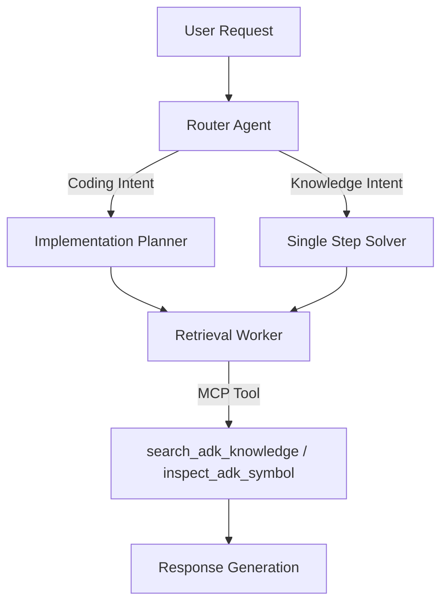
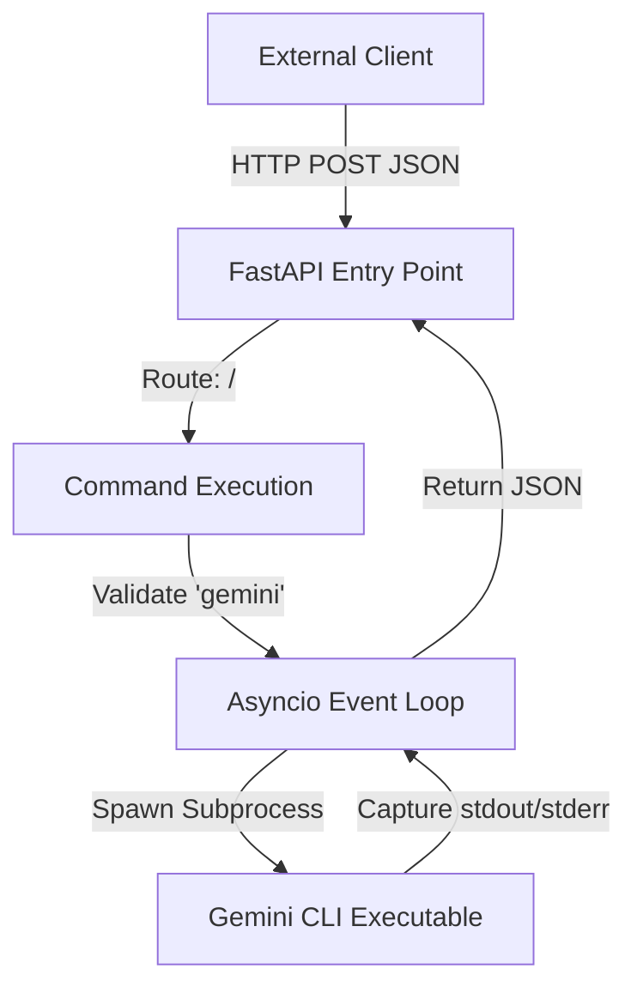
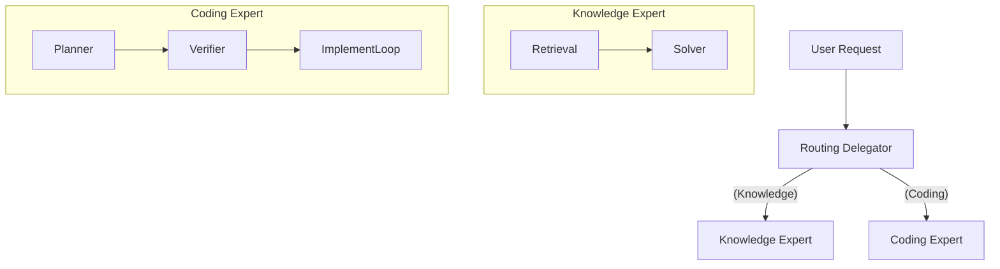
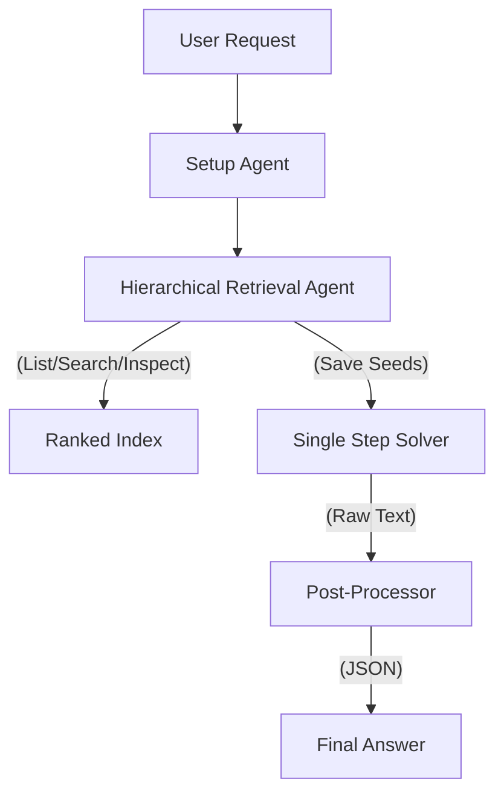

# Answer Generator Architectures

This file documents the architectural designs of the Answer Generators used in the benchmark suite. It is used by the report generator to provide context for the AI analysis.

## gemini-cli:mcp_adk_agent_runner_ranked_knowledge

**Source Image:** `gemini-cli:mcp_adk_agent_runner_ranked_knowledge`

### Core Philosophy
A metric-driven, hybrid multi-agent architecture that utilizes a central Router to dispatch tasks to specialized experts (Coding vs. Knowledge) backed by a high-fidelity, MCP-integrated ranked knowledge index.

### Topology
Hierarchical Router-Gateway with Specialized Expert Agents

### Key Tool Chain
- `search_adk_knowledge` (Semantic/BM25 search against Ranked Knowledge Index)
- `inspect_adk_symbol` (Precise lookup of code symbols)
- `list_adk_modules` (Ranked browsing of API surface)
- PodmanModel (Container lifecycle)

### Architecture Overview
The system operates as a containerized Agent Generator. It employs a Router-Gateway pattern where an incoming request is first analyzed by a 'Router' agent. Based on intent, the request is dispatched to one of two primary sub-agent chains: the 'Implementation Planner' (Coding Expert) or the 'Single Step Solver' (Knowledge Expert). These experts leverage a custom Model Context Protocol (MCP) server to access a 'Ranked Knowledge Index' via specific tools. The entire lifecycle is wrapped in a rigorous benchmarking framework that executes agents in isolated containers.

### Variants
- **bm25 (Default):** Uses BM25/Hybrid search.
- **keyword:** Uses pure Keyword search (baseline).

### Call Hierarchy


## gemini-cli:base

### Core Philosophy
A lightweight, asynchronous wrapper designed to expose local system CLI execution and file system access via a RESTful HTTP interface.

### Topology
Client-Server (REST API Gateway Pattern)

### Key Tool Chain
- Python 3 / FastAPI / Uvicorn
- Gemini CLI (Native)

### Architecture Overview
The architecture functions as a bridge between HTTP clients and the local operating system. It utilizes FastAPI to define a lightweight server that intercepts network requests and translates them into local system actions. The design relies heavily on Python's `asyncio` library to perform non-blocking subprocess execution, allowing the server to spawn shell commands (specifically the `gemini` CLI) and capture their `stdout` and `stderr` without halting the web server's event loop.

### Call Hierarchy


## gemini-cli:adk-docs-ext

**Source:** `https://github.com/pierpaolo28/adk-docs-ext` (main branch)

### Core Philosophy
A documentation-centric environment designed to assist developers by providing access to ADK documentation tools.

### Architecture Overview
This image installs the standard `adk-docs-ext` extension. It likely provides tools or context injection related to the ADK documentation, serving as a baseline for the documentation-enhanced variants.

## gemini-cli:adk-docs-ext-starter

**Source:** `https://github.com/pierpaolo28/adk-docs-ext` (agent-starter-pack branch)

### Core Philosophy
A minimalist "Starter Pack" configuration.

### Architecture Overview
This variant is built from the `agent-starter-pack` branch. It likely represents a stripped-down or essential set of documentation tools, testing the model's performance with a lighter context load compared to the full documentation suite.

## gemini-cli:adk-docs-ext-llms

**Source:** `https://github.com/pierpaolo28/adk-docs-ext` (llms.txt branch)

### Core Philosophy
Optimized for Large Language Models using the `llms.txt` standard.

### Architecture Overview
This image includes the `llms.txt` file (or tools to read it), which is a standardized format for providing condensed, LLM-friendly documentation context. This variant tests the effectiveness of providing a curated, token-efficient context summary to the model.

## gemini-cli:adk-docs-ext-llms-full

**Source:** `https://github.com/pierpaolo28/adk-docs-ext` (llms-full.txt branch)

### Core Philosophy
Maximum context injection.

### Architecture Overview
This variant uses the `llms-full.txt` branch, implying a comprehensive, detailed dump of the ADK documentation in the `llms.txt` format. It tests the model's ability to handle and utilize a large context window populated with extensive domain knowledge, potentially at the cost of higher latency or "lost in the middle" effects.

## ADK_HYBRID_V47

### Core Philosophy
A specialized "Mixture of Experts" architecture that routes user requests to either a dedicated "Coding Expert" (implementation loop) or a "Knowledge Expert" (retrieval pipeline) to maximize performance on distinct task types.

### Topology
Hierarchical Router-Gateway with Specialized Expert Agents.

### Architecture Overview
The system employs a Router to analyze the incoming request.
- If **Knowledge**, it delegates to the Knowledge Expert, which uses hierarchical retrieval and shared history to answer questions.
- If **Coding**, it delegates to the Coding Expert, which uses an isolated iterative loop to plan, write, run, and verify code in a temporary workspace.

### Call Hierarchy


## ADK_RANKED_V46

### Core Philosophy
A retrieval-augmented generation (RAG) agent that utilizes a pre-computed "ranked index" of the ADK codebase to perform efficient, hierarchical knowledge discovery before attempting to answer queries.

### Topology
Sequential Pipeline (Hierarchical Retrieval -> Single Step Solver -> JSON Formatter)

### Architecture Overview
The system operates in two distinct phases: Discovery and Solving. 
1. The **Retrieval Agent** explores the ADK API surface using a paginated "ranked index" (most used classes first). It saves relevant "seeds" (class names) to the session state.
2. The **Solver** uses the conversation history (including the retrieval steps and docstrings) to generate a comprehensive natural language response.
3. A **Post-Processor** ensures the final output adheres to the strict JSON schema required by the benchmark harness.

### Key Tool Chain
- `list_ranked_targets`: Browses a paginated list of ADK symbols ranked by usage/importance.
- `search_ranked_targets`: Performs keyword searches against the index.
- `inspect_fqn`: Retrieves detailed docstrings, class hierarchy, and members for a specific Fully Qualified Name.

### Call Hierarchy

## gemini-cli:adk_skill

### Concise Summary
- **Core Philosophy:** Encapsulated execution of the Gemini CLI within an isolated Podman container to ensure reproducible environments and secure tool interaction.
- **Topology:** Containerized Sandbox Wrapper / Service Proxy
- **Key Tool Chain:** `Python 3.x`, `Podman (Container Runtime)`, `gemini-cli (Target Application)`, `aiohttp (Network Communication)`, `Docker/Container Images`

---

### Extensive Architectural Breakdown

> **1. Architecture Overview**
> The system implements a bridge pattern where the Python AnswerGenerator orchestrates a Podman container. The architecture isolates the execution of the external 'gemini-cli' tool within a defined container environment. It handles lifecycle management (setup/teardown), environment variable injection (for API keys and configuration), and I/O marshaling. The system can operate in two modes: direct command execution within the container or acting as a proxy to an HTTP service running inside the container.
>
> **2. Tool Chain Analysis**
> - **`GeminiCliPodmanAnswerGenerator`**: Main orchestration class acting as the interface between the host application and the containerized tool. (e.g., *Instantiated with image definitions to run specific model versions.*)
> - **`PodmanContainer`**: Abstraction layer for managing the Podman lifecycle (start, stop, execute). (e.g., *Used in self.setup() to launch the container before commands are sent.*)
> - **`gemini-cli`**: The command-line interface tool being executed to generate AI responses. (e.g., *Called with --model and --output-format arguments inside the container.*)
> - **`aiohttp`**: Asynchronous HTTP client for proxy mode communication. (e.g., *Used to POST JSON payloads to self._base_url when _is_proxy is True.*)
> 
>
> **3. Call Hierarchy & Flow**
> ```
> Client/Test Runner
>       |
>       v
> GeminiCliPodmanAnswerGenerator.run_cli_command()
>       | (Lazy Setup Check)
>       +---> .setup() --> PodmanContainer.start()
>       |
>       +---[Mode Switch]---------------------+
>       |                                     |
>       v (Direct Mode)                       v (Proxy Mode)
> PodmanContainer.send_command()        aiohttp.post(base_url)
>       |                                     |
>       v                                     v
> [Podman Container / Execution Environment]
>       |
>       +---> gemini-cli --model ... (Process)
>                 |
>       <---------+ (stdout/stderr)
>       |
>       v
> TraceLogEvent Construction & Error Parsing
>       |
>       v
> Return (Response Dict, Logs)
> ```
>
> **4. Detailed Call Flow Example**
> 1. User calls `run_cli_command(['explain', 'quantum physics'])`.
> 2. Generator checks `_setup_completed`. If False, calls `setup()` to spin up the Podman container.
> 3. Generator merges `extra_env` with API keys.
> 4. Arguments are formatted (prepending context instructions if present).
> 5. Command is sent to the container (via socket or HTTP proxy).
> 6. The `gemini-cli` tool runs inside the container; stdout contains JSON, stderr contains logs.
> 7. Generator parses stderr for specific error patterns (e.g., 'Error when talking to Gemini API').
> 8. Output is parsed (potentially using `parse_cli_stream_json_output`).
> 9. A structured dictionary with 'stdout', 'stderr', and 'response' is returned along with execution logs.
>
> **5. Key Components**
> - **`GeminiCliPodmanAnswerGenerator`**: Primary class handling initialization, environment configuration, and public API methods for generating answers.
> - **`setup`**: Idempotent async method that ensures the backend Podman container is built (if required) and running before execution.
> - **`run_cli_command`**: Core logic that marshals arguments, injects environment variables, executes the command remotely, and processes the raw output.
> - **`TraceLogEvent`**: Data structure used to capture detailed execution telemetry (stderr, raw stdout, internal errors) for debugging.
> - **`parse_cli_stream_json_output`**: Helper function (external) to convert raw CLI streaming output into structured JSON objects.
> 

