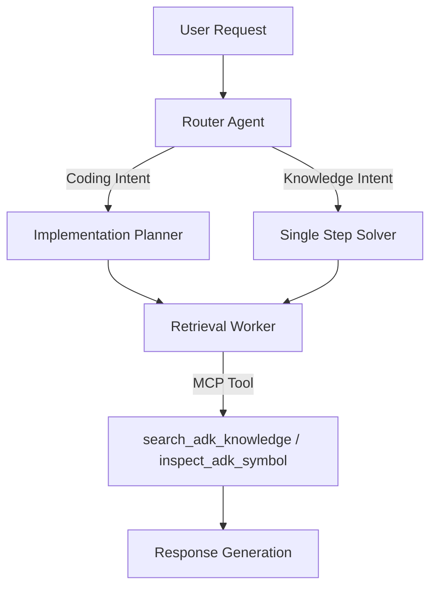
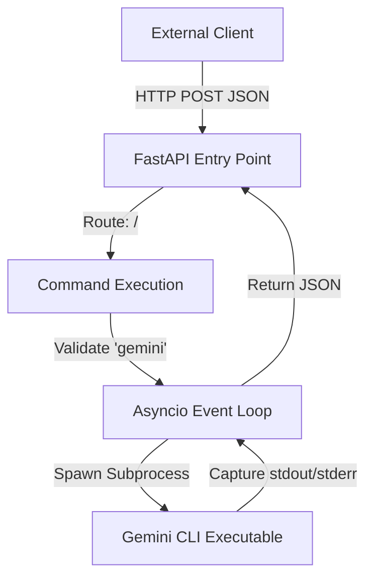

# Answer Generator Architectures

This file documents the architectural designs of the Answer Generators used in the benchmark suite. It is used by the report generator to provide context for the AI analysis.

## ranked_knowledge_bm25

**Source Image:** `gemini-cli:mcp_adk_agent_runner_ranked_knowledge`

### Core Philosophy
A metric-driven, hybrid multi-agent architecture that utilizes a central Router to dispatch tasks to specialized experts (Coding vs. Knowledge) backed by a high-fidelity, MCP-integrated ranked knowledge index.

### Topology
Hierarchical Router-Gateway with Specialized Expert Agents

### Key Tool Chain
- `search_adk_knowledge` (Semantic/BM25 search against Ranked Knowledge Index)
- `inspect_adk_symbol` (Precise lookup of code symbols)
- `list_adk_modules` (Ranked browsing of API surface)
- PodmanModel (Container lifecycle)

### Architecture Overview
The system operates as a containerized Agent Generator. It employs a Router-Gateway pattern where an incoming request is first analyzed by a 'Router' agent. Based on intent, the request is dispatched to one of two primary sub-agent chains: the 'Implementation Planner' (Coding Expert) or the 'Single Step Solver' (Knowledge Expert). These experts leverage a custom Model Context Protocol (MCP) server to access a 'Ranked Knowledge Index' via specific tools. The entire lifecycle is wrapped in a rigorous benchmarking framework that executes agents in isolated containers.

### Call Hierarchy

## ranked_knowledge_keyword

**Source Image:** `gemini-cli:mcp_adk_agent_runner_ranked_knowledge`
*(Variant using Keyword Search provider)*

### Core Philosophy
Same as `ranked_knowledge_bm25`, but configured to use a pure Keyword search strategy for the knowledge retrieval layer. This serves as a baseline to evaluate the impact of BM25/Semantic search ranking.

### Architecture Overview
Identical to `ranked_knowledge_bm25`. The `ADK_SEARCH_PROVIDER` environment variable is set to `keyword`.

## gemini-cli:base

### Core Philosophy
A lightweight, asynchronous wrapper designed to expose local system CLI execution and file system access via a RESTful HTTP interface.

### Topology
Client-Server (REST API Gateway Pattern)

### Key Tool Chain
- Python 3 / FastAPI / Uvicorn
- Gemini CLI (Native)

### Architecture Overview
The architecture functions as a bridge between HTTP clients and the local operating system. It utilizes FastAPI to define a lightweight server that intercepts network requests and translates them into local system actions. The design relies heavily on Python's `asyncio` library to perform non-blocking subprocess execution, allowing the server to spawn shell commands (specifically the `gemini` CLI) and capture their `stdout` and `stderr` without halting the web server's event loop.

### Call Hierarchy

