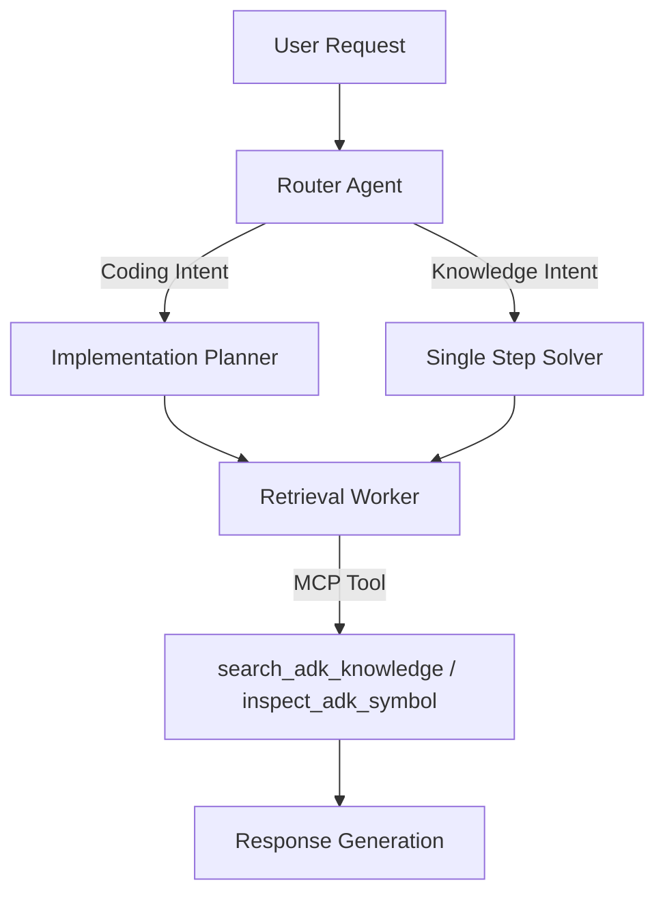

# Answer Generator Architectures

This file documents the architectural designs of the Answer Generators used in the benchmark suite. It is used by the report generator to provide context for the AI analysis.

## gemini-cli:mcp_adk_agent_runner_ranked_knowledge

**Source Image:** `gemini-cli:mcp_adk_agent_runner_ranked_knowledge`

### Core Philosophy
A metric-driven, hybrid multi-agent architecture that utilizes a central Router to dispatch tasks to specialized experts (Coding vs. Knowledge) backed by a high-fidelity, MCP-integrated ranked knowledge index.

### Topology
Hierarchical Router-Gateway with Specialized Expert Agents

### Key Tool Chain
- `search_adk_knowledge` (Semantic/BM25 search against Ranked Knowledge Index)
- `inspect_adk_symbol` (Precise lookup of code symbols)
- `list_adk_modules` (Ranked browsing of API surface)
- PodmanModel (Container lifecycle)

### Architecture Overview
The system operates as a containerized Agent Generator. It employs a Router-Gateway pattern where an incoming request is first analyzed by a 'Router' agent. Based on intent, the request is dispatched to one of two primary sub-agent chains: the 'Implementation Planner' (Coding Expert) or the 'Single Step Solver' (Knowledge Expert). These experts leverage a custom Model Context Protocol (MCP) server to access a 'Ranked Knowledge Index' via specific tools. The entire lifecycle is wrapped in a rigorous benchmarking framework that executes agents in isolated containers.

### Variants
- **bm25 (Default):** Uses BM25/Hybrid search.
- **keyword:** Uses pure Keyword search (baseline).

### Call Hierarchy


## gemini-cli:base

### Core Philosophy
A lightweight, asynchronous wrapper designed to expose local system CLI execution and file system access via a RESTful HTTP interface.

### Topology
Client-Server (REST API Gateway Pattern)

### Key Tool Chain
- Python 3 / FastAPI / Uvicorn
- Gemini CLI (Native)

### Architecture Overview
The architecture functions as a bridge between HTTP clients and the local operating system. It utilizes FastAPI to define a lightweight server that intercepts network requests and translates them into local system actions. The design relies heavily on Python's `asyncio` library to perform non-blocking subprocess execution, allowing the server to spawn shell commands (specifically the `gemini` CLI) and capture their `stdout` and `stderr` without halting the web server's event loop.

### Call Hierarchy
```mermaid
graph TD
    Client[External Client] -->|HTTP POST JSON| API[FastAPI Entry Point]
    API -->|Route: /| Exec[Command Execution]
    Exec -->|Validate 'gemini'| AsyncLoop[Asyncio Event Loop]
    AsyncLoop -->|Spawn Subprocess| CLI[Gemini CLI Executable]
    CLI -->|Capture stdout/stderr| AsyncLoop
    AsyncLoop -->|Return JSON| API

## gemini-cli:adk-docs-ext

**Source:** `https://github.com/pierpaolo28/adk-docs-ext` (main branch)

### Core Philosophy
A documentation-centric environment designed to assist developers by providing access to ADK documentation tools.

### Architecture Overview
This image installs the standard `adk-docs-ext` extension. It likely provides tools or context injection related to the ADK documentation, serving as a baseline for the documentation-enhanced variants.

## gemini-cli:adk-docs-ext-starter

**Source:** `https://github.com/pierpaolo28/adk-docs-ext` (agent-starter-pack branch)

### Core Philosophy
A minimalist "Starter Pack" configuration.

### Architecture Overview
This variant is built from the `agent-starter-pack` branch. It likely represents a stripped-down or essential set of documentation tools, testing the model's performance with a lighter context load compared to the full documentation suite.

## gemini-cli:adk-docs-ext-llms

**Source:** `https://github.com/pierpaolo28/adk-docs-ext` (llms.txt branch)

### Core Philosophy
Optimized for Large Language Models using the `llms.txt` standard.

### Architecture Overview
This image includes the `llms.txt` file (or tools to read it), which is a standardized format for providing condensed, LLM-friendly documentation context. This variant tests the effectiveness of providing a curated, token-efficient context summary to the model.

## gemini-cli:adk-docs-ext-llms-full

**Source:** `https://github.com/pierpaolo28/adk-docs-ext` (llms-full.txt branch)

### Core Philosophy
Maximum context injection.

### Architecture Overview
This variant uses the `llms-full.txt` branch, implying a comprehensive, detailed dump of the ADK documentation in the `llms.txt` format. It tests the model's ability to handle and utilize a large context window populated with extensive domain knowledge, potentially at the cost of higher latency or "lost in the middle" effects.
```
