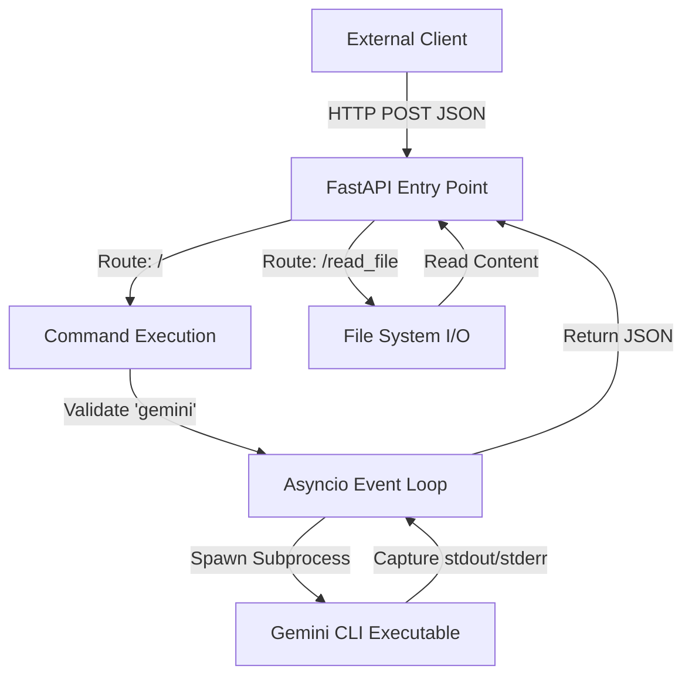

# Gemini CLI Base Image

## Core Philosophy
A lightweight, asynchronous wrapper designed to expose local system CLI execution and file system access via a RESTful HTTP interface.

## Topology
Client-Server (REST API Gateway Pattern)

## Key Tool Chain
- Python 3
- FastAPI
- Uvicorn
- Asyncio
- Gemini CLI

## Architecture Overview
The architecture functions as a bridge between HTTP clients and the local operating system. It utilizes FastAPI to define a lightweight server that intercepts network requests and translates them into local system actions. The design relies heavily on Python's `asyncio` library to perform non-blocking subprocess execution, allowing the server to spawn shell commands (specifically the `gemini` CLI) and capture their `stdout` and `stderr` without halting the web server's event loop. Additionally, it provides direct read access to the local filesystem, effectively serving as a remote execution agent.

## Tool Chain Analysis
| Tool Name | Purpose | Example Usage |
|-----------|---------|---------------|
| FastAPI | Provides the web server framework to handle HTTP requests and JSON parsing. | Defines the `@app.post('/')` route to receive command arguments. |
| Asyncio Subprocess | Manages system-level process execution asynchronously. | Used in `create_subprocess_exec` to run the 'gemini' command without blocking. |
| Gemini CLI | The target executable tool that contains the actual AI logic. | The script validates that the first argument is 'gemini'. |
| Uvicorn | ASGI server implementation to run the FastAPI application. | Starts the server on port 8080 via `uvicorn.run(app, ...)`. |

## Call Hierarchy

## Key Components
| Component Name | Responsibility |
|----------------|----------------|
| `run_command` | The primary execution engine; parses JSON requests, merges env vars, manages subprocess lifecycle. |
| `read_file` | Provides read-only access to the host file system. |
| `health_check` | A simple endpoint returning status for orchestrators. |
