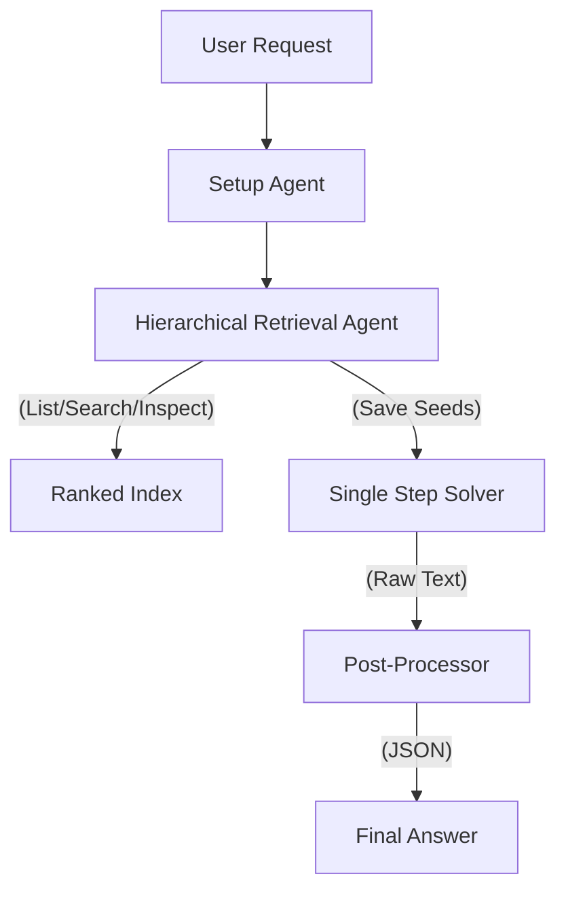

# Experiment 66: Statistical Discovery V46 (Ranked Index Retrieval)

## Core Philosophy
A retrieval-augmented generation (RAG) agent that utilizes a pre-computed "ranked index" of the ADK codebase to perform efficient, hierarchical knowledge discovery before attempting to answer queries.

## Topology
Sequential Pipeline (Hierarchical Retrieval -> Single Step Solver -> JSON Formatter)

## Key Tool Chain
- **Hierarchical Retrieval Agent**: Browses and searches a ranked list of ADK symbols.
- **Single Step Solver**: Generates the raw text answer using retrieved context.
- **Gemini 2.0 Flash/Pro**: Underlying LLM.
- **Ranked Knowledge Index**: `ranked_targets.yaml` (Static artifact).

## Architecture Overview
The system operates in two distinct phases: Discovery and Solving. 
1. The **Retrieval Agent** explores the ADK API surface using a paginated "ranked index" (most used classes first). It saves relevant "seeds" (class names) to the session state.
2. The **Solver** uses the conversation history (including the retrieval steps and docstrings) to generate a comprehensive natural language response.
3. A **Post-Processor** ensures the final output adheres to the strict JSON schema required by the benchmark harness.

## Tool Chain Analysis
| Tool Name | Purpose | Example Usage |
|-----------|---------|---------------|
| `list_ranked_targets` | Browse top-tier ADK classes. | `list_ranked_targets(page=1)` -> Returns `[Agent, LlmAgent, ...]` |
| `search_ranked_targets` | Find specific symbols by keyword. | `search_ranked_targets("routing")` |
| `inspect_fqn` | Get full docstrings and signatures. | `inspect_fqn("google.adk.agents.LlmAgent")` |
| `save_selected_seeds` | Mark retrieval as complete. | `save_selected_seeds(["LlmAgent"])` |

## Call Hierarchy

## Key Components
| Component Name | Responsibility |
|----------------|----------------|
| `HierarchicalRetrievalAgent` | Navigates the huge ADK codebase efficiently using ranking. |
| `SingleStepSolver` | Synthesizes the answer from the context found by the retrieval agent. |
| `PostProcessedAdkAnswerGenerator` | Wraps the ADK agent and handles the final text-to-JSON conversion. |
