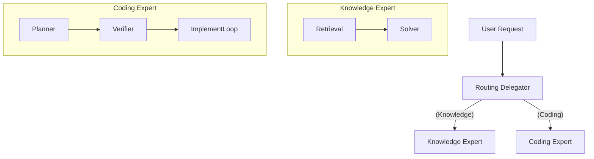

# Experiment 67: Hybrid Specialist V47 (Routed Ranked Retrieval)

## Core Philosophy
A specialized "Mixture of Experts" architecture that routes user requests to either a dedicated "Coding Expert" (implementation loop) or a "Knowledge Expert" (retrieval pipeline) to maximize performance on distinct task types.

## Topology
Hierarchical Router-Gateway with Specialized Expert Agents.

## Key Tool Chain
- **Router Agent**: Classifies intent (Coding vs. Knowledge).
- **Knowledge Expert**: Uses Shared History retrieval (from Experiment 66).
- **Coding Expert**: Uses an isolated "Implementation Loop" (Planner -> Code -> Verify).
- **Post-Processor**: Formats final output.

## Architecture Overview
The system employs a **Router** to analyze the incoming request.
- If **Knowledge**, it delegates to the **Knowledge Expert** (same as V46/Exp66), which uses hierarchical retrieval and shared history to answer questions.
- If **Coding**, it delegates to the **Coding Expert** (V29 style), which uses an isolated iterative loop to plan, write, run, and verify code in a temporary workspace.
This separation allows for "Deep Work" on coding tasks without polluting the context of simple Q&A tasks, and vice versa.

## Tool Chain Analysis
| Tool Name | Purpose | Example Usage |
|-----------|---------|---------------|
| `route_task` | Router decides the path. | `route_task("CODING")` |
| `run_adk_agent` | Used by Coding Expert to verify code. | `run_adk_agent(prompt="test", ...)` |
| `inspect_fqn` | Used by both experts for API discovery. | `inspect_fqn("google.adk.agents.Agent")` |

## Call Hierarchy

## Key Components
| Component Name | Responsibility |
|----------------|----------------|
| `RoutingDelegator` | The decision maker that splits the control flow. |
| `SharedHistorySolver` | The V46-style solver for knowledge tasks. |
| `CodingExpert` | The V29-style iterative loop for complex implementation tasks. |
