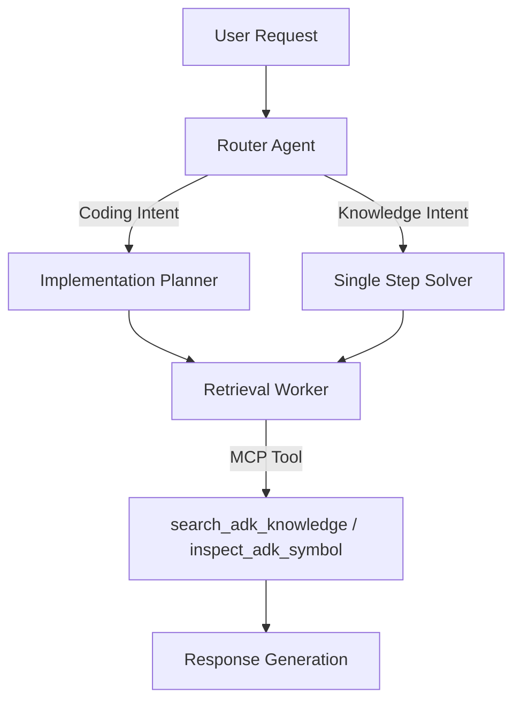

# MCP ADK Agent Runner (Ranked Knowledge)

## Core Philosophy
A metric-driven, hybrid multi-agent architecture that utilizes a central Router to dispatch tasks to specialized experts (Coding vs. Knowledge) backed by a high-fidelity, MCP-integrated ranked knowledge index.

## Topology
Hierarchical Router-Gateway with Specialized Expert Agents

## Key Tool Chain
- `search_adk_knowledge`
- `inspect_adk_symbol`
- PodmanModel
- Forensic Root Cause Analysis
- Benchmark Suite Aggregator

## Architecture Overview
The system operates as a containerized Agent Generator. It employs a Router-Gateway pattern where an incoming request is first analyzed by a 'Router' agent. Based on intent, the request is dispatched to one of two primary sub-agent chains: the 'Implementation Planner' (Coding Expert) or the 'Single Step Solver' (Knowledge Expert). These experts leverage a custom Model Context Protocol (MCP) server to access a 'Ranked Knowledge Index' via specific tools. The entire lifecycle is wrapped in a rigorous benchmarking framework (Vibeshare/Podman) that executes agents in isolated containers, logs internal traces, and performs forensic analysis.

## Tool Chain Analysis
| Tool Name | Purpose | Example Usage |
|-----------|---------|---------------|
| `search_adk_knowledge` | Semantic search against Ranked Knowledge Index. | Solver retrieves docs for 'Knowledge' intent. |
| `inspect_adk_symbol` | Precise lookup of code symbols. | Fetching signature of `CodeExecutionTool`. |
| `PodmanModel` | Manages containerized AI model lifecycle. | Running `gemini-cli` in isolated env. |
| Forensic Analyzer | Automated root cause analysis. | Generates failure taxonomy report. |

## Call Hierarchy

## Key Components
| Component Name | Responsibility |
|----------------|----------------|
| `analyze_accuracy.py` | Aggregates execution results and calculates pass rates. |
| `Router` | Architectural gateway for intent classification. |
| `PodmanModel` | Runtime abstraction for secure container execution. |
| `Forensic Database` | Stores failure analysis and root causes. |
