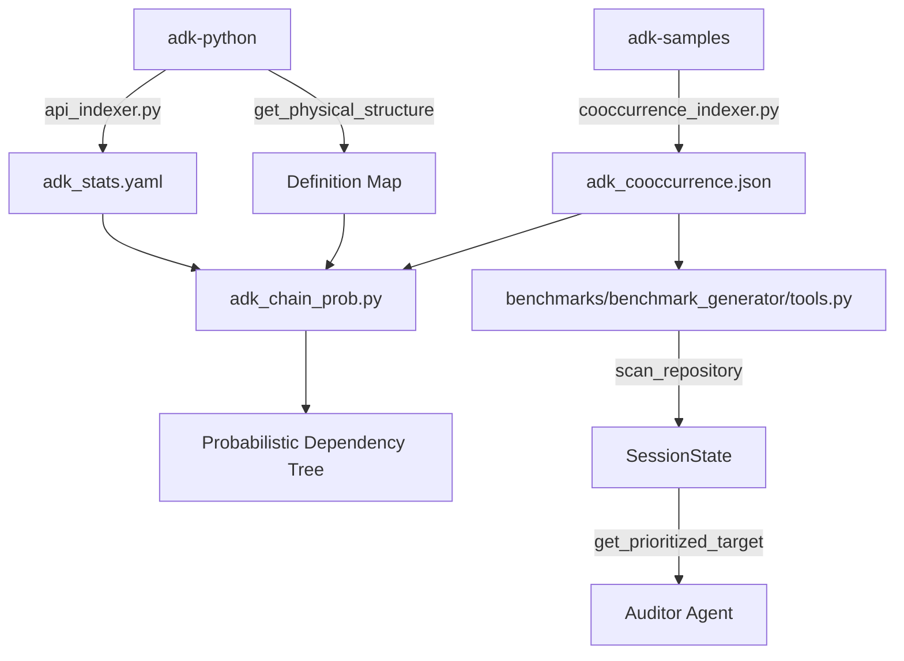

# Design Doc: ADK Probabilistic Chain Analyzer (`adk_chain_prob.py`)

## 1. Objective
To visualize the "API Surface" of the ADK framework as a probabilistic dependency tree. Starting from a root node (e.g., `google.adk.agents.Agent`), the tool maps out what other modules, classes, methods, and parameters are statistically likely to be relevant based on real-world usage patterns in `adk-samples`.

## 2. Core Logic

### A. Data Sources
1.  **Structure (`get_physical_structure`)**: Scans `adk-python` to build a static map of Modules -> Classes -> Methods -> Parameters -> Types.
2.  **Usage (`adk_stats.yaml`)**: Provides call counts for specific methods and parameters.
3.  **Co-occurrence (`adk_cooccurrence.json`)**: Provides conditional probabilities ($P(B|A)$) for module/class imports.

### B. Algorithm: The "Chain Rule" BFS
We calculate the relevance of any node $N$ relative to the start node $S$ using a Breadth-First Search:
$$P(N) = P(Parent) \times P(N | Parent)$$

*   **Global Context**: BFS expands from $S$ to find related *Modules* and *Classes*.
*   **Local Context**: Once a Class is identified, we drill down into its *Methods* and *Parameters*.

### C. Heuristics & Rules
1.  **Constructor Inheritance**: If a Class is relevant ($P > 0$), its `__init__` method is assumed to be relevant ($P_{local} = 1.0$) because usage implies instantiation.
2.  **Parameter Visibility**: Parameters are shown if they have non-zero usage OR if their parent method is highly probable (heuristic exploration).
3.  **Type Unwrapping**: If a parameter type hint refers to another ADK entity (e.g., `config: RunConfig`), that entity is recursively displayed (linked) to show the dependency chain.
4.  **Alias Resolution**: The tool must resolve public aliases (e.g., `google.adk.agents.LlmAgent`) to their canonical definitions (`google.adk.agents.llm_agent.LlmAgent`) to retrieve structure.

## 3. Output Specification

The output must be a hierarchical tree (not a flat list) that visually distinguishes between transitive probability (Chain P) and structural containment.

**Format:**
```text
Rank | Chain P  | Type     | Identifier
--------------------------------------------------------------------------------
1    | 1.0000   | Module   | google.adk.agents
       ©️ Agent                                         [P(Class|Module): 1.00]
         ƒ __init__                                     [P(Method|Class): 1.00]
           🔹 name (str)                                [P(Param): 1.00]
           🔹 tools (List[BaseTool])                    [P(Param): 0.45]
             ↳ 📦 google.adk.tools.BaseTool             (Type Dependency)
```

### Legend
*   📦 **Module**
*   ©️ **Class**
*   ƒ **Method**
*   🔹 **Parameter**
*   🔸 **Property**
*   ↳ **Type Link** (Recursive Unwrap)
*   🔗 **Co-occurrence Link** (BFS Neighbor)

## 4. Implementation Details
*   **Path**: `tools/adk_chain_prob.py`
*   **Dependencies**: `ast`, `json`, `yaml`.
*   **Filtering**: Omit nodes with $P=0$ unless they are structural parents of relevant nodes. Eliminate "Unknown" types via fuzzy matching and alias maps.

## 5. System Architecture & API Flow

### Component Diagram



### Key Modules & Functions

1.  **`tools/cooccurrence_indexer.py`**
    *   `analyze_repo(path)`: Scans all files to count import pairs.
    *   `ImportVisitor`: AST visitor that extracts module usage per file.
    *   **Output**: JSON list of `{context, target, probability}`.

2.  **`tools/adk_chain_prob.py`**
    *   `get_physical_structure(repo_path)`: Scans definitions to build a hierarchy map (Module -> Class -> Method). Resolves aliases via `__init__.py`.
    *   `main()`:
        *   Loads Co-occurrence JSON and Usage YAML.
        *   Runs **Probabilistic BFS** starting from `--start`.
        *   Calls `print_node_recursive()` to render the tree.

3.  **`benchmarks/benchmark_generator/tools.py` (Agentic Integration)**
    *   `scan_repository()`: Loads `adk_cooccurrence.json` into session state.
    *   `get_prioritized_target()`: Uses BFS logic (similar to `adk_chain_prob`) to find `associated_modules` for the active target, instructing the Observer to use them.

### Data Schema (adk_cooccurrence.json)
```json
{
  "associations": [
    {
      "context": "google.adk.agents",
      "target": "google.adk.tools",
      "probability": 0.19,
      "support": 18
    }
  ]
}
```

### Flow of Execution (Agentic Loop)

1.  **Auditor** calls `scan_repository` -> Loads stats, coverage, and co-occurrence data.

2.  **Target Prioritization (Iterative)**: 

    *   The system determines the **Updated Coverage** based on currently generated benchmarks.

    *   Targets are ranked based on two primary factors:

        *   **Relevancy**: Co-occurrence probability ($P(Target|Root)$) with major root nodes like `Agent`, `BaseTool`, or `LlmAgent`.

        *   **Coverage Lift**: The potential increase in total repository coverage gained by generating a benchmark for this target.

    *   This ranking can be computed upfront (ranked list) or iteratively after each generation to account for overlapping coverage.

3.  **Task Queue**: Prioritized targets are pushed to a task queue.

4.  **Worker Pull**: Multiple workers pull from the task queue concurrently to generate benchmarks.

5.  **Observer** generates code using the target and its expanded context (discovered via BFS).
